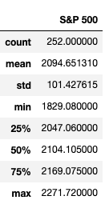
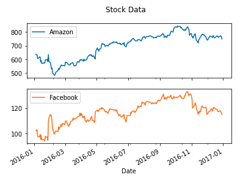
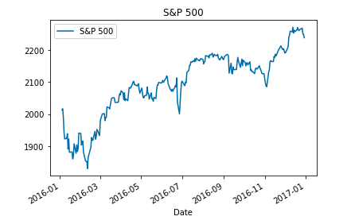
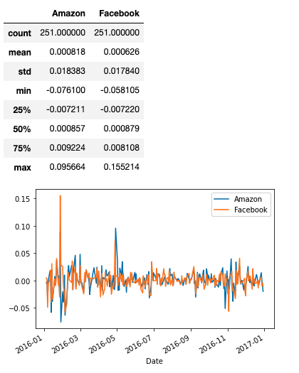
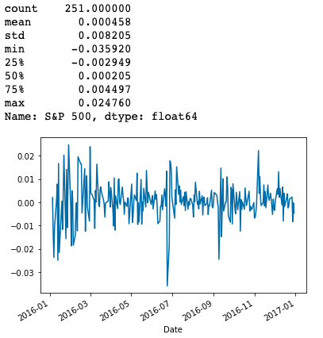
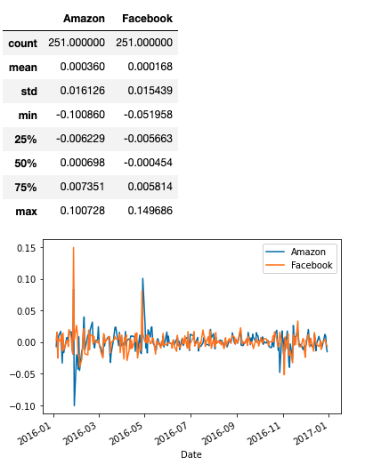
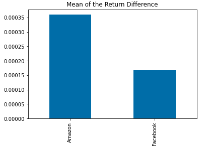
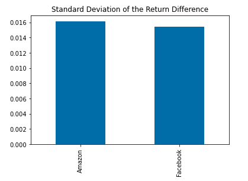
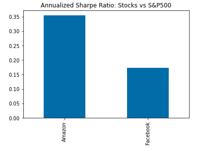

# Calculate Profitability and Risk of different investments using the Sharpe Ratio 
When evaluating whether to invest in assets, you must not only look at how much money you can make but also how much risk you take. The Sharpe Ratio, developed by Nobel Laureate William Sharpe about 50 years ago, did exactly this: it compares the return on investment with the return on alternative investments and compares the relative return with investment risk Associate to return. In this tutorial, you will use pandas to apply Sharpe ratios to actual financial data.

**Sharp Ratio**

Let us understand the Sharpe ratio by calculating the Sharpe ratio of the stocks of the two tech giants Facebook and Amazon. As a benchmark, we will use the S&P 500 to measure the performance of the top 500 US stocks. When we use a stock index instead of a risk-free rate, the result is called the information ratio, which is used to measure the return of active portfolio management because it can tell you how much return a portfolio manager can get at a given risk unit relative to Put your money into low-cost index funds.

**Visualize the Data**

Before comparing investments in Facebook or Amazon with the index of the 500 largest companies in the United States, let's visualize the data so that we can better understand what we are dealing with.

Let's also take a closer look at the value of the S&P 500, our benchmark.

The Sharpe ratio uses the difference in return between the two investment opportunities under consideration.
However, our data shows the historical value of each investment, not the return. To calculate revenue, we need to calculate the percentage change in value from one day to the next. We will also look at summary statistics because when we calculate the Sharpe Ratio, these will become our input.

For S&P 500, the method of calculating the daily rate of return is the same, we just need to make sure that it is selected as a series using a single square bracket [] instead of selecting a data frame to facilitate the next calculation.

Next, we calculate the relative performance of the stock relative to the S&P 500 index. The calculation method is the return difference between stock_returns and sp_returns every day.

**Computing the Sharpe Ratio**

Now we can finally start calculating the Sharpe ratio. First, we need to calculate the average of excess_returns. This tells us how much money or less investment income is compared to the benchmark each day.

Next, we calculate the standard deviation of extra_returns. Compared with S&P 500 investment, this shows us the amount of risk implied by stock investment.

Finally, we only need to calculate the ratio of avg_excess_returns to sd_excess_returns. The result now is the final “sharp ratio”, and it indicates how much (or less) there are investment opportunities in return considering the risk-return ratio per unit.
The Sharpe ratio is usually annualized by multiplying it by the square root of the number of periods. We use daily data as input, so we will use the square root of the number of trading days (5 days, 52 weeks, minus a few holidays): √252

